# Roundtable Presentation

[Presentation Slides](https://docs.google.com/presentation/d/1G4I_dOgLInmbCOXPpRyAwmytpZNC8j4N36em8inW_Zg/edit?usp=sharing)

## 💡 Final Project Idea #1

### Concept

This project is an interactive, gaze-powered experience set in a dark room. The core idea is that **your eyes act as a flashlight** -- illuminating different parts of the space as you explore with your gaze. As you look around, the room gradually reveals its environment, mood, and narrative through visuals and sound.

---

### Key Features

- **Gaze-Based Illumination**
  - The space begins in near-total darkness. As the user focuses on specific elements, light reveals them and triggers environmental changes.

- **Ambient Audio Feedback**
  - Looking at the **window**: lightning flickers and thunder rolls softly in the distance, setting a stormy night mood.
  - Looking at the **TV**: the screen powers on, showing flickering animations accompanied by background audio from a looping video.

- **Micro-Interactions**
  - Gaze at the **drawer**: it slowly opens.
  - Gaze at the **lamp**: it turns on and casts a soft glow around it.

---

### Storyboard

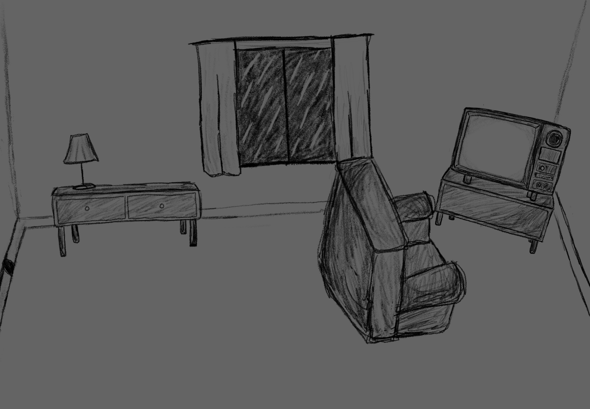
**Figure 1**: Default dark room.

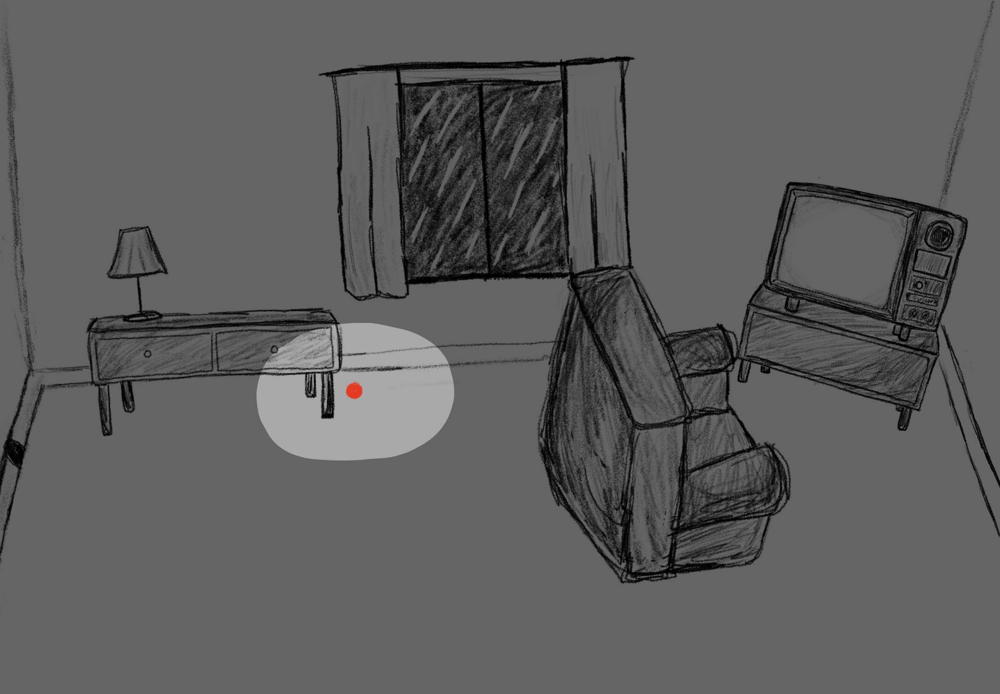
**Figure 2**: Showing light lumination based on user's gaze. Red dot marks where the user is looking at.

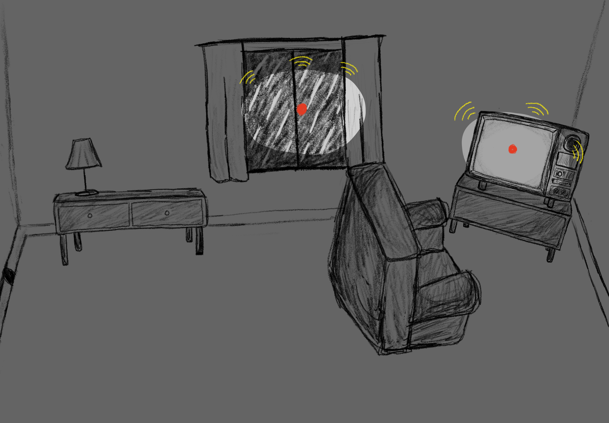
**Figure 3**: Ambient audio feedback depending on region of gaze.

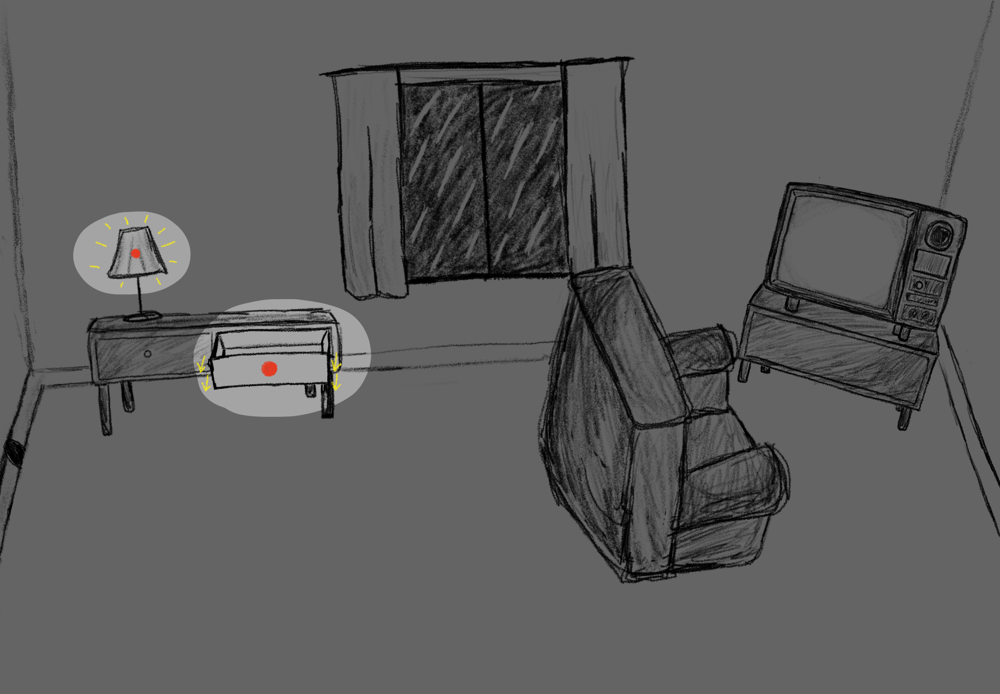
**Figure 4**: Object interaction based on focus of gaze.

---

### References/Resources

- `WebGazer.js` for eye tracking
  - [Nicholas Renotte: Intro to WebGazer.js](https://www.youtube.com/watch?v=Wh77ZGdIaZQ)
  - [Web Dev Simplified: WebGazer Gaze Tracking Tutorial](https://www.youtube.com/watch?v=6s2Ug-eVpVc)

  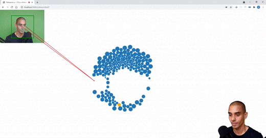

- `p5.sound` for layered audio feedback
  - [The Coding Train: p5.sound Tutorial](https://www.youtube.com/watch?v=Pn1g1wjxl_0&list=PLRqwX-V7Uu6aFcVjlDAkkGIixw70s7jpW)

---

## 🌷 Final Project Idea #2

### Concept

This project presents an infinite, generative terrain -- a grassy landscape that evolves through gaze-based interaction. The user's gaze causes different elements to appear based on which part of the environment they are looking at. The goal is to create a calm, reactive ecosystem powered entirely by where the user looks.

---

### Key Features

- **Seed Blooming**
  - Looking at a **seed** causes it to grow and bloom into a flower.

- **Animal Interaction**
  - Looking at a **grassy area**: a **bunny** appears and begins hopping around the scene.

- **Sky Interaction**
  - Looking at the **sky**: a **bird** appears and flies through the air.

- **Procedural Terrain Generation**
  - The grassy landscape scrolls infinitely with new elements randomly placed as the user continues to look around.

- **Eye-Tracking Control**
  - The entire system is controlled by the user's gaze using eye-tracking, with no keyboard or mouse input required.

---

### Storyboard

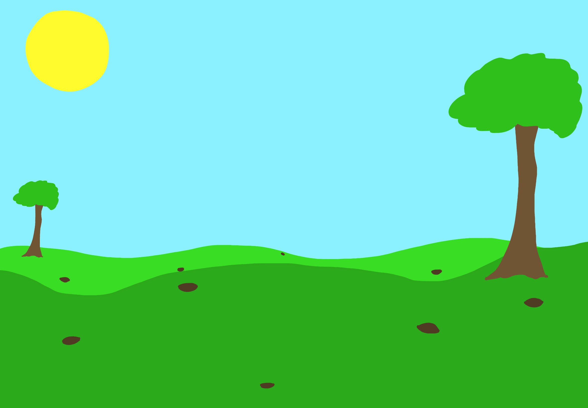
**Figure 5**: Default grass terrain.

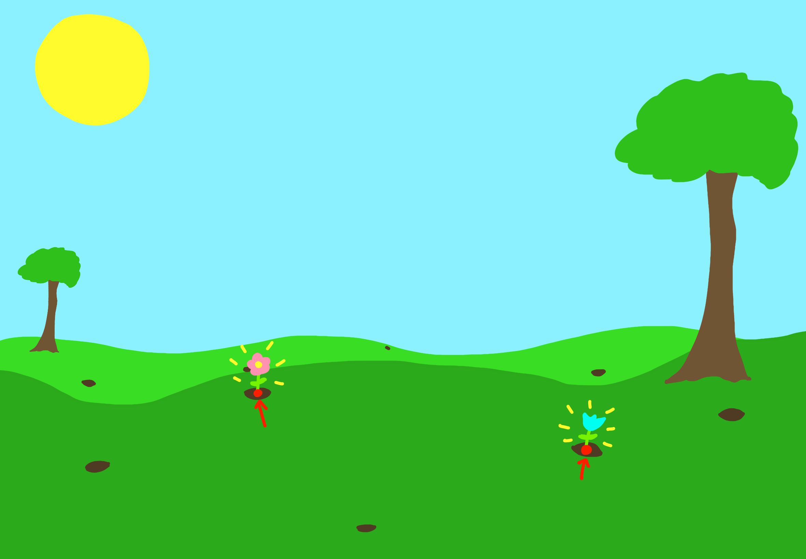
**Figure 6**: Looking and focusing on a seed will bloom a flower.

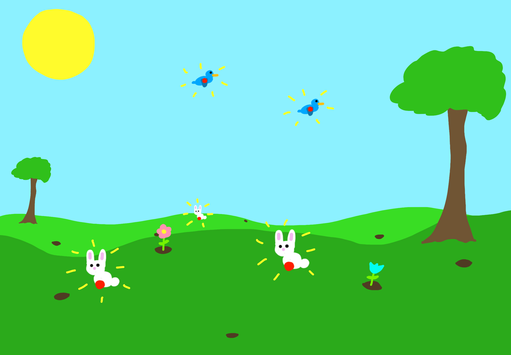
**Figure 7**: Looking and focusing on a landscape region will spawn an animal.

### References/Resources

- `WebGazer.js` for eye tracking
  - [Nicholas Renotte: Intro to WebGazer.js](https://www.youtube.com/watch?v=Wh77ZGdIaZQ)
  - [Web Dev Simplified: WebGazer Gaze Tracking Tutorial](https://www.youtube.com/watch?v=6s2Ug-eVpVc)
- Using **Perlin Noise** to create generative landscape
  - [The Coding Train: 3D Terrain Generation with Perlin Noise](https://www.youtube.com/watch?v=IKB1hWWedMk)

  

---

## 🎮 Final Project Idea #3

### Concept

This project is an interactive game where the player launches a ball to hit falling letters that match a prompted word shown at the bottom. The goal is to hit each letter in order before time runs out.

---

### Key Features

- **Projectile Interaction**
  - Move the ball left/right and launch it upward to hit letters.

- **Feedback System**
  - Correct hit: increases the speed of falling letters.
  - Incorrect hit: decreases the speed of falling letters.

- **Score & Rounds**
  - Completing a word correctly: +1 to score.
  - Failing to complete a word (time runs out): score resets.
  - A new word is shown after each round.

---

### Storyboard

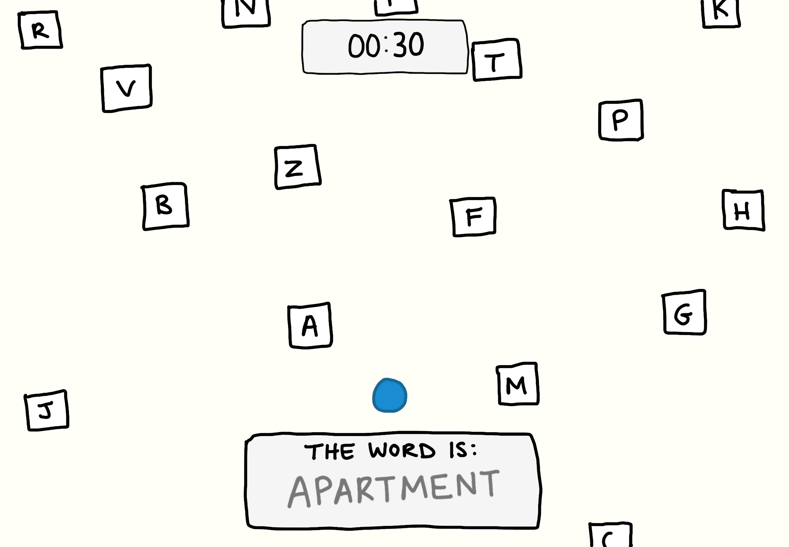  
**Figure 8**: Default game screen with the prompted word, falling letters, projectile ball, and timer.

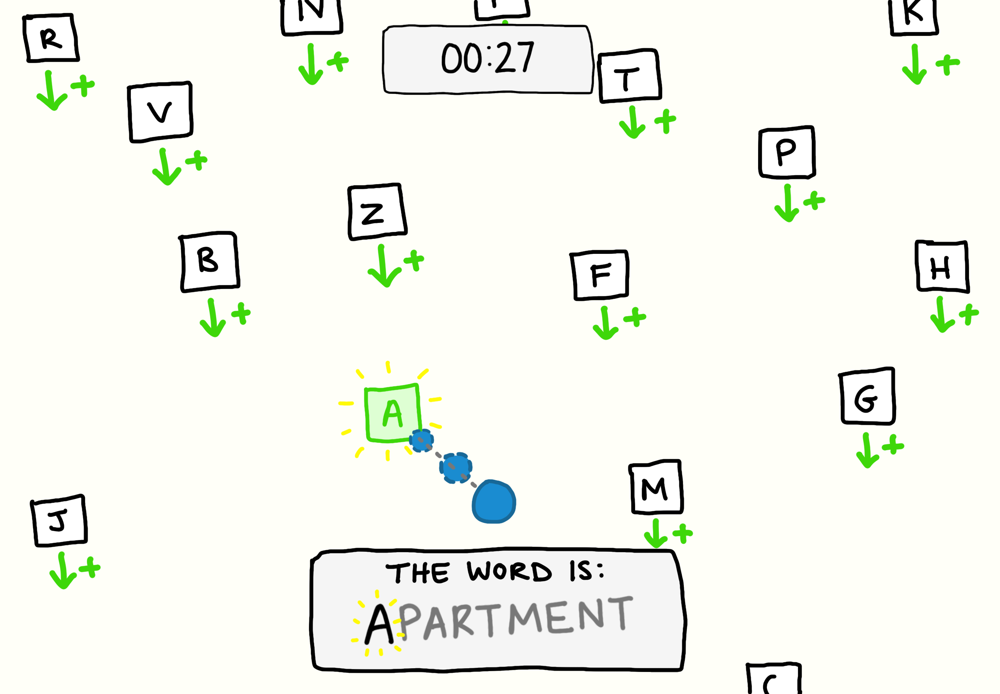  
**Figure 9**: When the ball hits the correct letter, that letter is marked in the word and the falling speed increases.

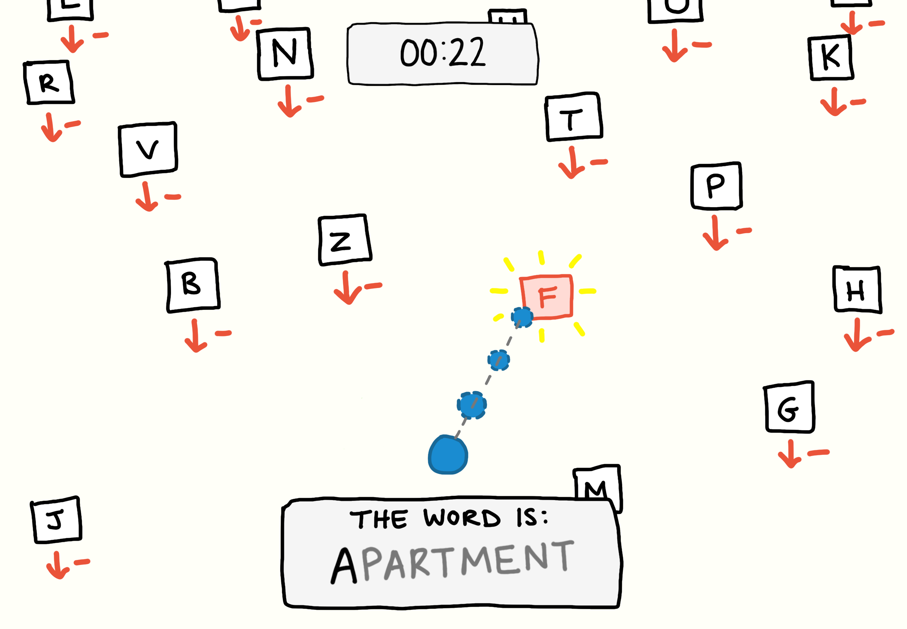  
**Figure 10**: When the ball hits the wrong letter, the falling speed decreases.

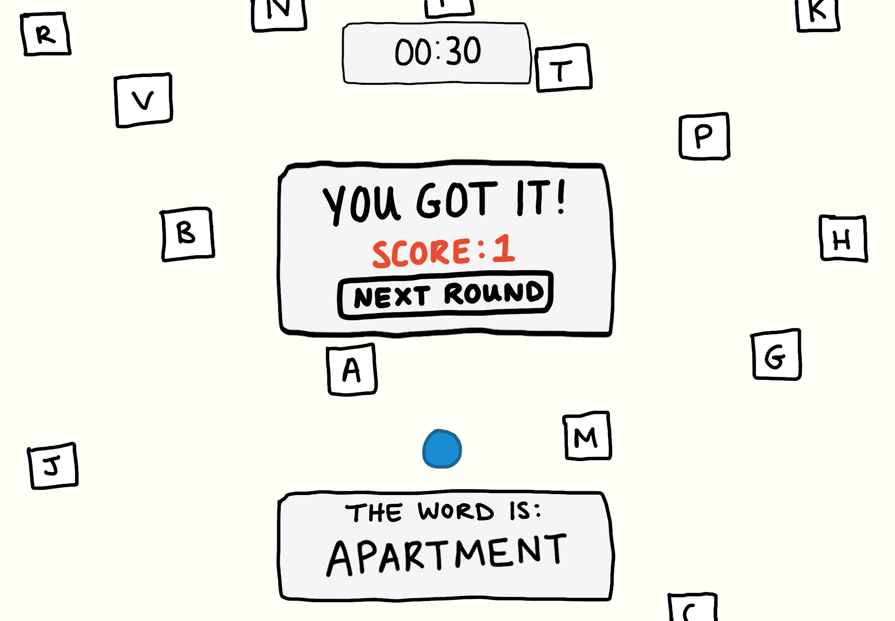  
**Figure 11**: After all correct letters are hit, a winning screen appears.

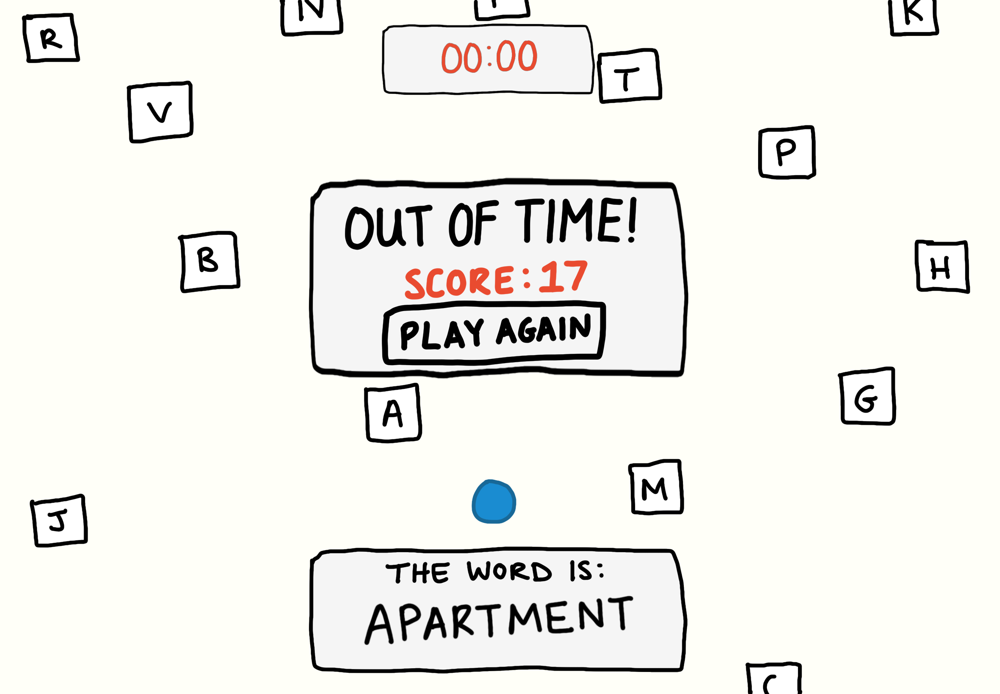  
**Figure 12**: If time runs out before completing the word, a losing screen is shown.

---

### References/Resources

- **Random Word API** to fetch a new word for each round
  - [https://random-word-api.herokuapp.com/home](https://random-word-api.herokuapp.com/home)

- `p5.Vector` for handling the ball's movement and collision detection with falling letters
  - [Break Those Blocks - Moonflower2022](https://moonflower2022.github.io/break-those-blocks/)
  
  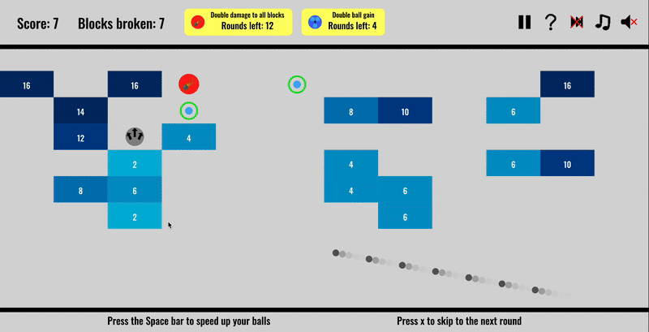
